# 声悦 - NarratorAI

智能情感陪伴聊天机器人前端项目

<div align="center">

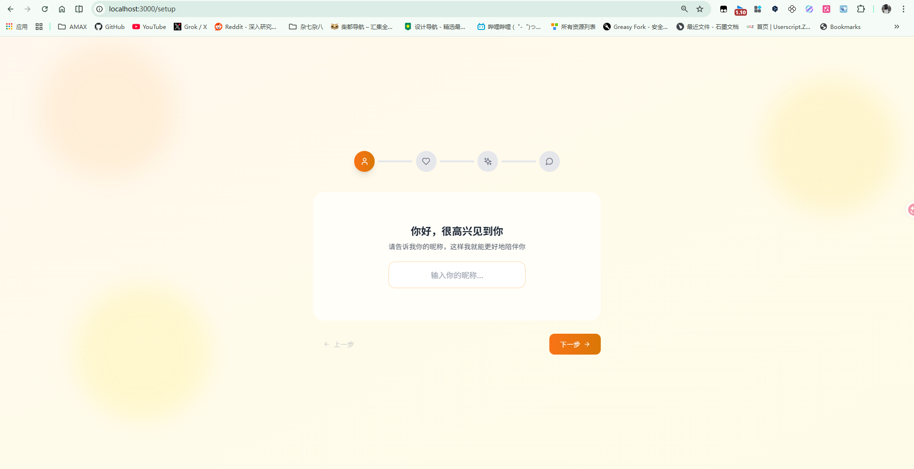

</div>

## 页面预览

### 聊天界面

| 基础聊天 | 表情包互动 | 好感度面板 |
|:---:|:---:|:---:|
| 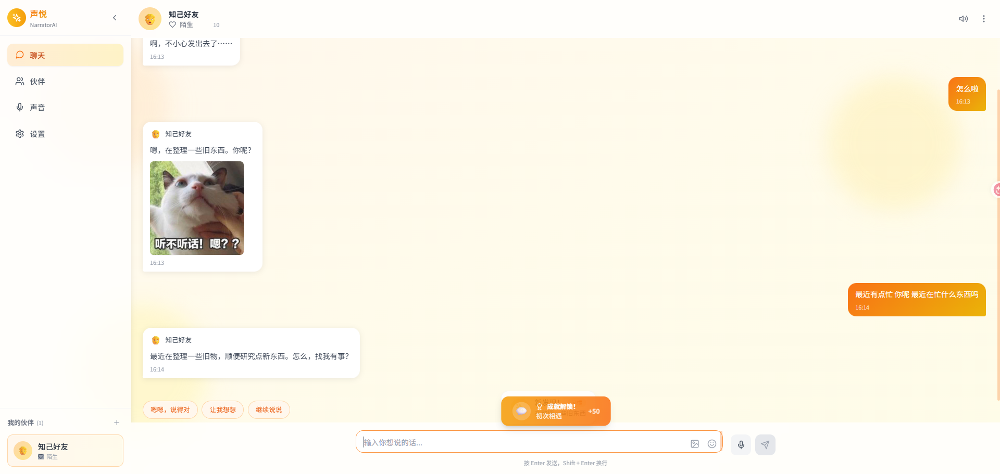 | 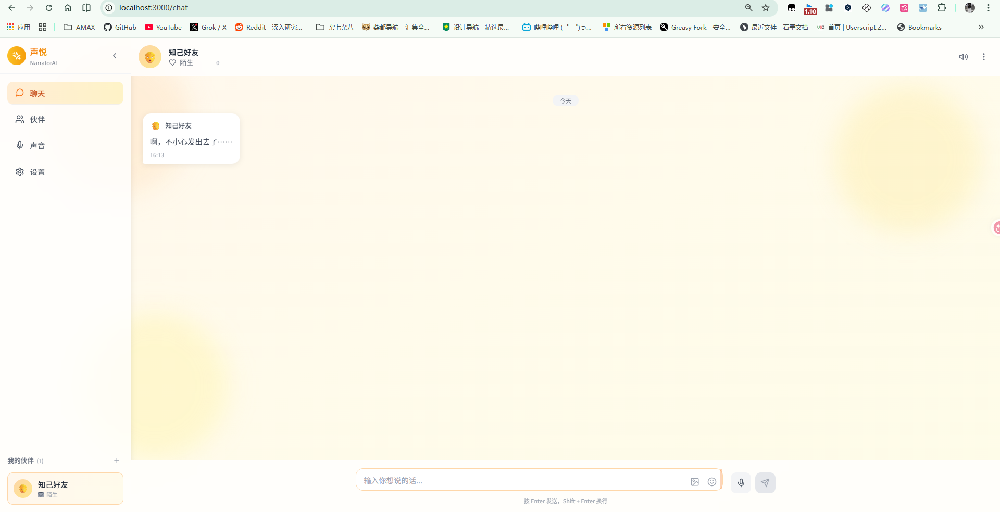 | 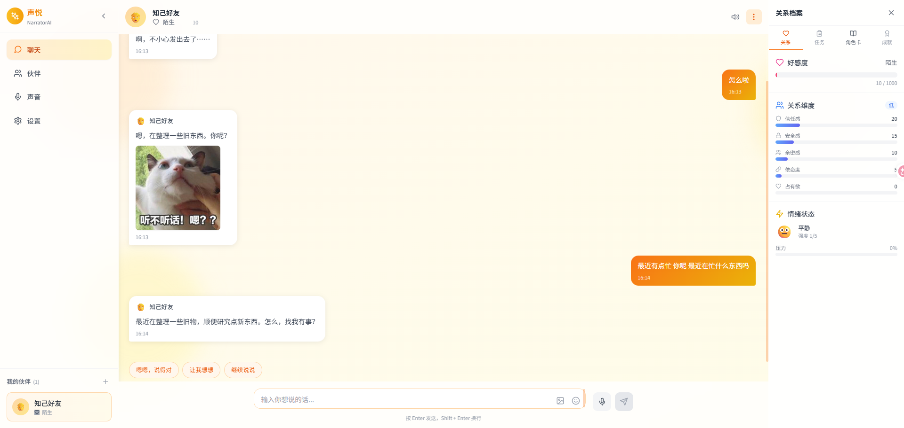 |

### 任务与角色

| 每日任务 | 角色卡片 | 新发现 |
|:---:|:---:|:---:|
| 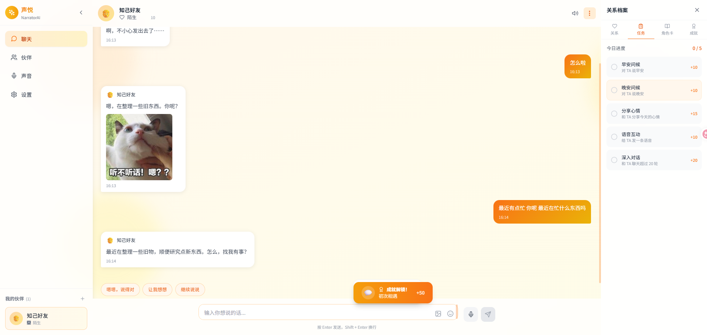 | 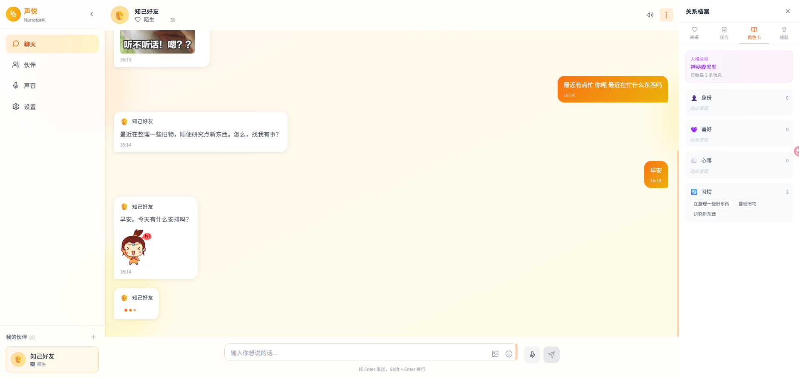 | 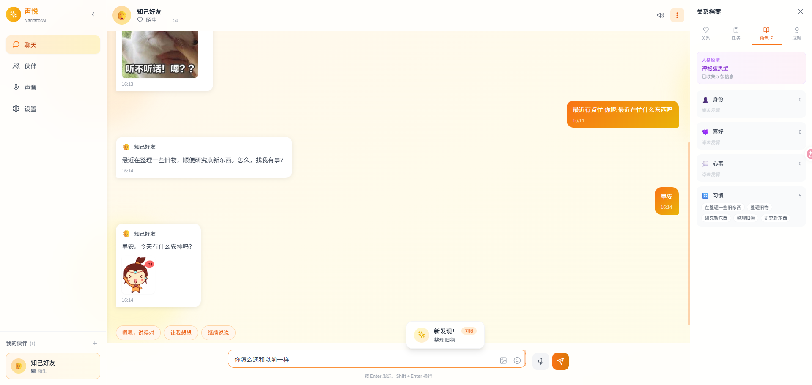 |

### 成就系统

| 成就面板 |
|:---:|
| 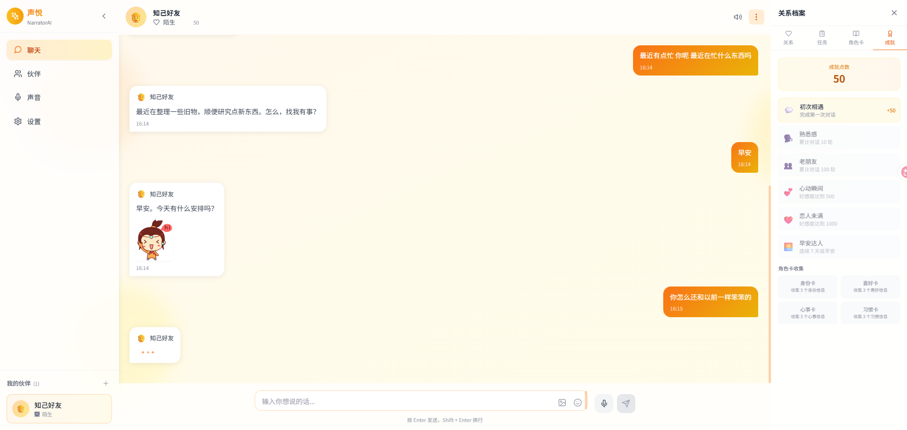 |

### 其他页面

| 伙伴管理 | 声音中心 | 设置 |
|:---:|:---:|:---:|
| 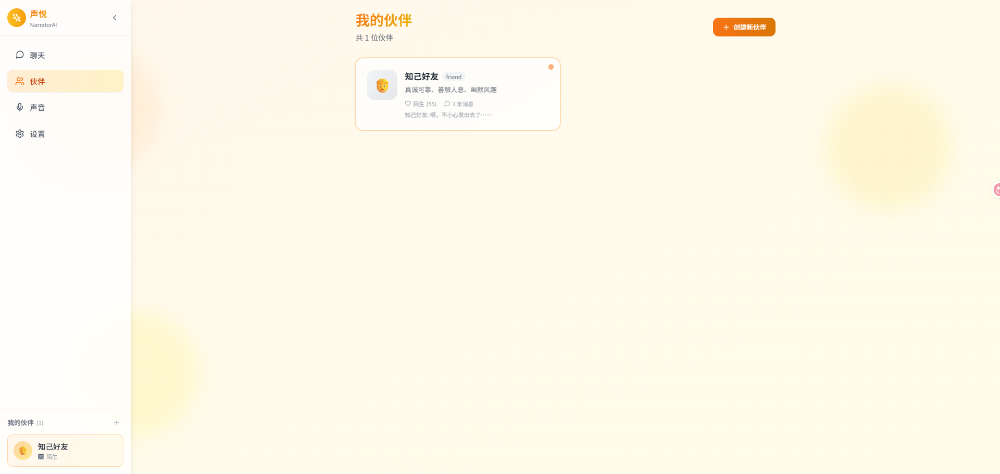 | 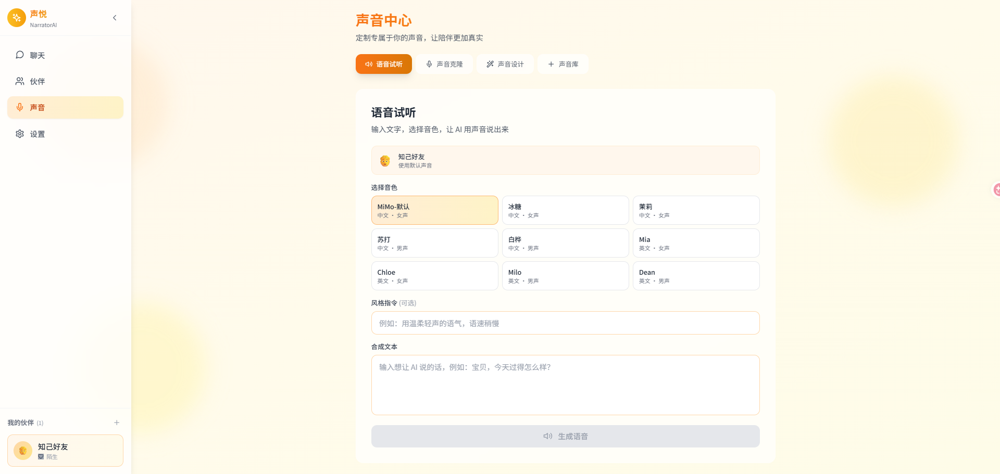 | 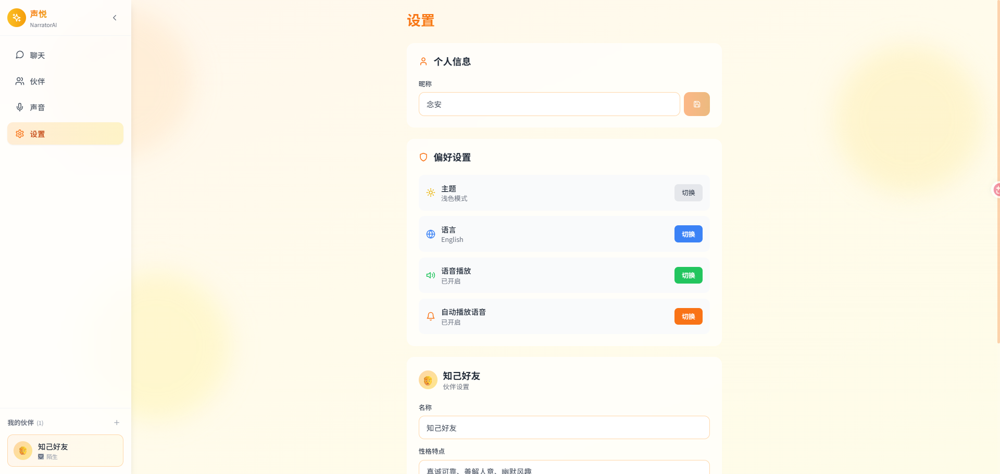 |

## 功能特性

- **多角色陪伴** — 男友、女友、好友、导师等多种陪伴角色，自由设定人设
- **AI 智能对话** — MiMo-V2.5-Pro 驱动，支持上下文记忆，自然流畅
- **情绪表情包** — AI 回复时自动匹配情绪关键词，搜索并展示对应表情包
- **语音对话** — 实时语音交互，支持 TTS 语音合成
- **声音克隆** — 上传音频文件，AI 学习并克隆该声音
- **声音设计** — 通过文字描述生成独特声音
- **伙伴管理** — 独立管理页面，展示所有伙伴卡片、好感度、消息统计
- **好感度系统** — 互动提升好感度，解锁成就与特殊对话
- **成就与收集** — 聊天过程中解锁成就，获得收集品
- **日期分隔线** — 不同日期消息之间显示今天、昨天、具体日期标签
- **快捷回复** — AI 回复后显示 2-3 个上下文相关的快捷回复按钮
- **消息操作** — 右键/长按消息弹出菜单，可复制文本或删除消息
- **自动调整输入** — 输入多行时自动变高，最多 5 行
- **回到底部** — 向上滚动时右下角浮动按钮，点击平滑滚回
- **深色/浅色主题** — 自适应主题切换
- **个性化记忆** — 记住你的喜好和重要时刻

## 技术栈

| 分类 | 技术 |
|------|------|
| 框架 | React 18 + TypeScript |
| 构建 | Vite 5 |
| 样式 | Tailwind CSS 3 |
| 状态管理 | Zustand |
| 动画 | Framer Motion |
| 图标 | Lucide React |
| 路由 | React Router 6 |
| AI 接口 | MiMo AI API (对话 / TTS / 声音克隆) |

## 快速开始

### 1. 安装依赖

```bash
npm install
```

### 2. 配置环境变量

复制示例文件并填入你的 API Key：

```bash
cp .env.example .env
```

编辑 `.env`：

```env
VITE_MIMO_BASE_URL=https://api.xiaomimimo.com/anthropic
VITE_MIMO_AUTH_TOKEN=你的MiMo API Key
```

> **注意：** `.env` 文件已加入 `.gitignore`，不会被提交到仓库。API Key 仅在 Vite 开发代理中注入请求头，不会暴露到前端代码。

### 3. 启动开发服务器

```bash
npm run dev
```

访问 http://localhost:3000

### 4. 构建生产版本

```bash
npm run build
```

## 项目结构

```
src/
├── components/          # 通用组件
│   ├── Layout.tsx         # 页面布局
│   ├── Sidebar.tsx        # 侧边导航栏
│   ├── AffectionDisplay.tsx  # 好感度展示
│   ├── RelationshipPanel.tsx # 关系面板
│   ├── AchievementToast.tsx  # 成就提示
│   └── CollectionToast.tsx   # 收集品提示
├── hooks/               # 自定义 Hooks
│   ├── useAudio.ts        # 音频播放
│   ├── useRecorder.ts     # 录音
│   ├── useSticker.ts      # 表情包搜索
│   └── useTheme.ts        # 主题切换
├── pages/               # 页面
│   ├── WelcomePage.tsx    # 欢迎页
│   ├── SetupPage.tsx      # 初始设置
│   ├── ChatPage.tsx       # 聊天主界面
│   ├── CompanionsPage.tsx # 伙伴管理
│   ├── SettingsPage.tsx   # 设置
│   └── VoicePage.tsx      # 语音设置
├── stores/              # 状态管理
│   └── useAppStore.ts     # 全局状态 (Zustand)
├── types/               # TypeScript 类型
│   └── index.ts
├── utils/               # 工具函数
│   ├── api.ts             # 通用 API
│   ├── mimo.ts            # MiMo API 客户端
│   └── characterAnalyzer.ts # 角色分析
├── App.tsx
├── main.tsx
└── index.css
```

## API 接口

### MiMo AI API

通过 Vite 代理调用，避免 CORS 问题。API Key 在服务端代理中注入，前端不直接携带密钥。

| 功能 | 代理路径 | 模型 |
|------|----------|------|
| 对话 | `/mimo/v1/messages` | mimo-v2.5-pro |
| 语音合成 | `/mimo-tts/audio/speech` | MiMo-V2.5-TTS |
| 声音克隆 | `/mimo-tts/audio/voices/clone` | MiMo-V2.5-TTS-VoiceClone |
| 声音设计 | `/mimo-tts/audio/voices/design` | MiMo-V2.5-TTS-VoiceDesign |

### 表情包 API

| 功能 | 代理路径 | 说明 |
|------|----------|------|
| 搜索表情包 | `/sticker/a/biaoq.php` | 根据关键词搜索，返回 JSON 数组 |

## 使用流程

1. 首次打开进入 **欢迎页面**，了解功能介绍
2. 点击"开始旅程"进入 **初始设置**，设定昵称、选择陪伴角色
3. 进入 **聊天界面**，开始与 AI 伙伴对话
4. 通过 **伙伴管理** 页面查看所有伙伴的好感度和消息统计
5. 在 **设置** 中调整昵称、切换主题、管理声音配置

## 许可证

[MIT License](LICENSE)

Copyright (c) 2024 NarratorAI
